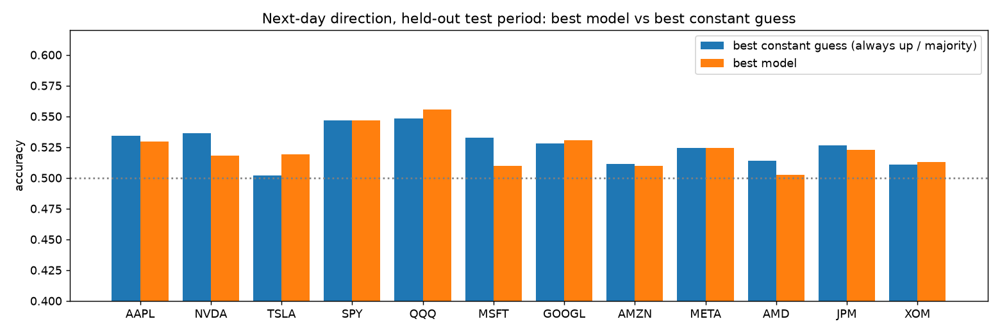
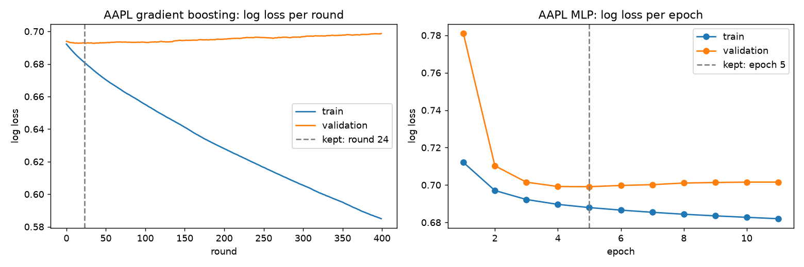

# Stock Price Movement Predictor


Can technical indicators predict whether a stock closes **up or down tomorrow**? This
project tests that on the **entire daily price history** of 12 US stocks and ETFs: 104,565
trading days from 1962 to 2026-10-02. It uses chronological splits, four models, honest
baselines, a significance test and a fee-adjusted trading test.

**Live dashboard:** https://gcsrmstockpricepredictor-seven.vercel.app

## Result

**No model beats a constant guess with statistical significance on any of the 12
tickers.** The best model per ticker is within ±2.3 percentage points of the better of
"always up" and "always down", and every one-sided binomial p-value is above 0.17.
ROC-AUC sits between 0.477 and 0.530 everywhere. This is what the efficient-market
hypothesis predicts for next-day moves in liquid US equities.

## Data

| | |
|---|---|
| Source | Yahoo Finance daily OHLCV via `yfinance` 1.7.0 (`period="max"`, unadjusted OHLC plus Adj Close) |
| Fetched | 2026-10-04 05:34 UTC (`download_data.py`; details in `data/download_meta.json`) |
| Tickers | AAPL, NVDA, TSLA, SPY, QQQ, MSFT, GOOGL, AMZN, META, AMD, JPM, XOM |
| History | each ticker's full history, from 1962-01-02 (XOM) or its listing date, to 2026-10-02 |
| Rows | 104,565 trading days; 103,929 usable after the 50-day indicator warm-up |

Open, High and Low are rescaled by `Adj Close / Close`, so every price feature is on the
same split- and dividend-adjusted scale. Without that, gap and range features jump at
every stock split; this was fixed while extending the data to full history.
Yahoo Finance data is for personal and research use.

**25 features**, all computed by hand in pandas from data up to the day's close:
- SMA ratios (10/20/50 days) and the SMA cross.
- RSI-14, MACD line, signal and histogram.
- Bollinger %B and bandwidth, normalised ATR.
- Stochastic %K/%D and Williams %R.
- OBV change, volume change and ratio.
- 1/5/10-day returns, 10/20-day volatility.
- High-low range, overnight gap and close position.

**Label:** 1 if tomorrow's adjusted close is above today's.

## Benchmark: every ticker, full history (`python benchmark.py`)

Per ticker, chronological split:
- The first 80% of days for training (the last 15% of those for validation: boosting
  round and MLP epoch selection).
- The final 20% for testing. Logistic regression and the random forest train on the full
  80%.

The test column is the best constant guess on the test period ("always up" or "always
down", whichever scores higher). That's the bar a model must clear.

| Ticker | Usable days | Test period | Test days | LogReg | Random forest | Boosting | MLP | Best constant | Best model vs constant | p-value |
|---|---|---|---|---|---|---|---|---|---|---|
| AAPL | 11,465 | 2017-08-17 → 2026-10-01 | 2,293 | 50.28% | 51.68% | 52.94% | 50.50% | 53.42% | −0.48 pp | 0.6838 |
| NVDA | 6,917 | 2021-03-30 → 2026-10-01 | 1,384 | 50.14% | 51.81% | 51.59% | 51.66% | 53.61% | −1.80 pp | 0.9150 |
| TSLA | 4,041 | 2023-07-13 → 2026-10-01 | 809 | 51.92% | 50.68% | 51.17% | 51.17% | 50.19% | +1.73 pp | 0.1719 |
| SPY | 8,427 | 2020-01-16 → 2026-10-01 | 1,686 | 52.49% | 54.45% | 54.69% | 49.41% | 54.69% | +0.00 pp | 0.5115 |
| QQQ | 6,885 | 2021-04-09 → 2026-10-01 | 1,377 | 53.01% | 55.56% | 54.83% | 53.45% | 54.83% | +0.73 pp | 0.3039 |
| MSFT | 10,168 | 2018-08-28 → 2026-10-01 | 2,034 | 50.98% | 50.93% | 50.34% | 50.69% | 53.29% | −2.31 pp | 0.9824 |
| GOOGL | 5,516 | 2022-05-09 → 2026-10-01 | 1,104 | 52.45% | 51.72% | 53.08% | 50.36% | 52.81% | +0.27 pp | 0.4409 |
| AMZN | 7,342 | 2020-11-24 → 2026-10-01 | 1,469 | 50.10% | 50.99% | 48.20% | 50.85% | 51.12% | −0.13 pp | 0.5510 |
| META | 3,564 | 2023-11-28 → 2026-10-01 | 713 | 48.95% | 49.79% | 52.45% | 50.63% | 52.45% | +0.00 pp | 0.5143 |
| AMD | 11,676 | 2017-06-16 → 2026-10-01 | 2,336 | 48.29% | 49.96% | 48.63% | 50.26% | 51.37% | −1.11 pp | 0.8637 |
| JPM | 11,682 | 2017-06-15 → 2026-10-01 | 2,337 | 50.58% | 52.29% | 48.27% | 49.29% | 52.63% | −0.34 pp | 0.6372 |
| XOM | 16,246 | 2013-10-29 → 2026-10-01 | 3,250 | 51.29% | 50.77% | 49.78% | 50.06% | 51.08% | +0.21 pp | 0.4112 |



**ROC-AUC, log loss and training length (test period):**

| Ticker | ROC-AUC LogReg | RF | Boosting | MLP | Log loss RF | Boosting | Boosting best round | MLP best epoch |
|---|---|---|---|---|---|---|---|---|
| AAPL | 0.5028 | 0.5103 | 0.5154 | 0.4940 | 0.6924 | 0.6919 | 24 | 5 of 11 |
| NVDA | 0.5055 | 0.4950 | 0.5052 | 0.4774 | 0.6946 | 0.6942 | 51 | 8 of 14 |
| TSLA | 0.5149 | 0.5137 | 0.5063 | 0.5299 | 0.6930 | 0.6934 | 3 | 15 of 20 |
| SPY | 0.4990 | 0.5072 | 0.4972 | 0.5128 | 0.6901 | 0.6890 | 6 | 17 of 23 |
| QQQ | 0.5035 | 0.5160 | 0.5213 | 0.5104 | 0.6891 | 0.6877 | 10 | 19 of 23 |
| MSFT | 0.5158 | 0.5238 | 0.5157 | 0.5126 | 0.6923 | 0.6940 | 21 | 11 of 17 |
| GOOGL | 0.5205 | 0.5055 | 0.5234 | 0.5207 | 0.6932 | 0.6914 | 28 | 9 of 15 |
| AMZN | 0.4944 | 0.4874 | 0.4771 | 0.5167 | 0.6980 | 0.6933 | 1 | 6 of 12 |
| META | 0.5002 | 0.4950 | 0.4997 | 0.5161 | 0.7009 | 0.6921 | 1 | 9 of 15 |
| AMD | 0.4867 | 0.4958 | 0.4978 | 0.5024 | 0.6977 | 0.6984 | 1 | 16 of 20 |
| JPM | 0.5042 | 0.5121 | 0.4891 | 0.4925 | 0.6921 | 0.6970 | 32 | 8 of 14 |
| XOM | 0.5186 | 0.5088 | 0.5033 | 0.5021 | 0.6953 | 0.6944 | 14 | 6 of 12 |

Log loss of a coin flip is 0.6931. Boosting stops after 1-51 rounds because validation
loss stops improving almost immediately, a sign there is little stable signal to learn.



Precision, recall, F1, Brier score and confusion matrices for every model and ticker are
in `reports/benchmark.json`.

## Business test: trading the random forest's signal

Hold the stock the next day only when the model predicts "up"; otherwise hold cash. Pay
0.1% every time the position changes. Compared with buy-and-hold over the same test days:

| Ticker | Strategy return | Buy and hold | Strategy Sharpe | Buy-and-hold Sharpe | Strategy max drawdown | Buy-and-hold max drawdown | Days invested |
|---|---|---|---|---|---|---|---|
| AAPL | +706.9% | +799.1% | 1.097 | 0.954 | −33.1% | −38.5% | 67.7% |
| NVDA | +997.8% | +1,702.2% | 1.244 | 1.291 | −41.4% | −66.3% | 72.3% |
| TSLA | −37.3% | +27.4% | −0.059 | 0.416 | −58.9% | −53.8% | 69.6% |
| SPY | +167.5% | +153.9% | 0.876 | 0.794 | −23.1% | −33.7% | 89.2% |
| QQQ | +163.1% | +127.3% | 0.957 | 0.785 | −25.6% | −35.1% | 92.5% |
| MSFT | +310.7% | +402.4% | 0.948 | 0.826 | −31.2% | −37.1% | 45.5% |
| GOOGL | +95.3% | +203.5% | 0.669 | 0.950 | −42.1% | −31.7% | 86.2% |
| AMZN | +30.4% | +59.2% | 0.303 | 0.402 | −58.6% | −56.1% | 97.0% |
| META | +15.1% | +116.2% | 0.316 | 0.892 | −28.8% | −34.2% | 62.0% |
| AMD | +98.9% | +5,282.3% | 0.414 | 1.043 | −41.1% | −65.5% | 16.9% |
| JPM | +251.8% | +391.4% | 0.706 | 0.754 | −31.4% | −43.6% | 73.2% |
| XOM | −25.1% | +211.8% | 0.004 | 0.464 | −67.3% | −62.4% | 58.7% |

The strategy beats buy-and-hold on total return for 2 of 12 tickers (SPY, QQQ) and on
Sharpe ratio for 4 (AAPL, SPY, QQQ, MSFT), mostly by sitting out some volatile days.
Because accuracy itself isn't significantly better than a constant guess, treat those
four as unconfirmed rather than as an edge.

## Labelling variants (AAPL, full history: `python run.py`)

`run.py` tests four ways of defining the target on AAPL (train 1981-02-24 → 2017-08-16,
test 2017-08-17 → 2026-10-01). "Majority" here is the most common class in *training*,
which for 1981-2017 AAPL is "down/flat". Many early-decade days had zero price change.

| Model | A. next day | B. next day, 1% dead zone | C. 5-day, overlapping | D. 5-day, non-overlapping |
|---|---|---|---|---|
| Majority class (from training) | 46.58% | 56.57% | 58.00% | 57.30% |
| Persistence ("repeat the last move") | 49.72% | 52.85% | **81.99%** | 53.16% |
| Logistic regression, raw prices | 53.25% | 56.57% | 58.00% | 57.73% |
| Logistic regression | 50.28% | 54.89% | 50.50% | 51.20% |
| Random forest | 52.38% | 56.06% | 57.26% | 55.56% |
| Gradient boosting | 50.76% | 55.18% | 46.75% | 50.76% |

The 81.99% persistence score in variant C is an artifact. Overlapping 5-day windows share
4 of 5 days, so "repeat yesterday's label" is almost always right. Sampling every 5th day
(variant D) removes the overlap, and the score falls to 53.16%. Charts for every variant
are in `outputs/`.

## Dashboard

`index.html` is a static, dependency-free page (also served at `/dashboard`). It lets
you switch between the 12 tickers and the three models. All its data is generated by
`build_dashboard.py` from the benchmark:
- Accuracy, precision, recall, F1 and confusion matrix cover each ticker's full test
  period.
- The price, indicator and equity charts cover the last 252 trading days
  (2025-10-01 → 2026-10-01), after 0.1% costs.

## Reproduce

```bash
pip install -r requirements.txt
python download_data.py      # full history for all 12 tickers into data/
python benchmark.py          # reports/benchmark.json, figures, rebuilds index.html data (~1 minute)
python run.py --ticker AAPL  # the four labelling variants and outputs/ charts
pytest -q                    # 12 tests
```

## Tests

12 tests check:
- Data loading and sort order.
- That every indicator uses only past data (no look-ahead).
- Indicator bounds (RSI, %B, stochastics).
- The forward-shifted label.
- The chronological split and that the scaler is fitted on training data only.
- Both baselines, and the end-to-end pipeline.

CI runs them on every push.

## Limitations

- The tickers are today's large, successful companies (survivorship bias), which
  flatters buy-and-hold.
- Daily close-to-close only, no intraday data, no news, no fundamentals.
- Strategy returns ignore taxes and assume trading exactly at the close.

## License

MIT for the code. Price data © Yahoo Finance, for personal and research use.
